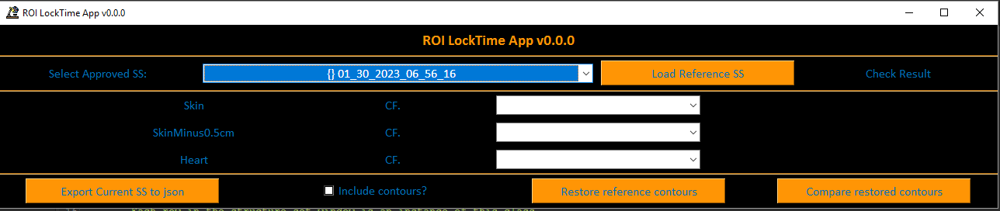

# CUH RayStation Apps 
This project contains a collection of python modules, and a few GUIs, for interacting with RayStation. 

Dependencies: 
- Python 3.6 or greater

--- 

## ROILockTime 
In planning it is sometimes necessary to unlock a Dr approved structure set to move Localisation POIs etc. 

The ROILockTime allows the planner to export a snapshot of the approved structure set, which can later be used by the plan checker to confirm that the ROI Geometries match those aprroved by the Dr to within:
- ± 0.1cc in volume 
- ± 1mm in Centroid 

Some seldom used additional functionality permits the export of the approved ROI Geometries to json, which can subsequently be restored. 

If contours have been restored into the current structure set, any matching ROI labels will have (1) suffixed to their label. 

There is also a button to quantitatively compare the restored contours. Results are exported in CSV format. 


### GUI User 



Planner:
1. Select the Dr approved structure set from the top drop down. 
2. Click Export to json. 

Checker: 
1. Select the Planner approved structure set from the top drop down. 
2. Click Load reference SS. 
3. Navigate to the Planner's export. 
4. Confirm that the Planner's ROI Geometries' volumes and centroids are consistent with the Dr approval. 

Notes:

The top drop down menu configures the selected sub-structure-set on the current exam. 

RayStation serialises structure set approvals - this is most easily understood when looking at the at the DICOM export window. You will see two or three structure sets relating to the different approvals (Dr, Planner etc.). 

There is, however, only one ROI Geometry per exam. 

Volume match is within ± 0.1cc, centroid match is within 1mm. 

The list of drop-downs allow you to compare different ROIs if the automatic selection fails. 

Ticking the Include contours? radio button will write the ROI Geometries to json as well. Be aware that this is memory intensive. 

If a reference structure set json file contains contours, these can be restored into the current structure set by clicking Restore reference contours. A *" (1)"* will be suffixed to any existing ROI labels. 

Clicking Compare restore contours will compare all ROIs with a *" (1)"* suffix to the pre-existing ROIs, returning a CSV of comparative metrics such as Dice Similarity Coefficient and Hausdorff distance to agreement. 

---

## API Reference 
Of course, you do not need to use the GUIs. The following section provides more information on the python modules behind the GUIs. 

### CUHGetCurrentStructureSetObject
Script object used to get the current structure set properties in RayStation. 

Subsequent script objects inherit from this. 

Attributes:
- exam 
- patientID
- case
- ss 

These are all self-explanatory RayStation get_current Script objects. 
`ss = case.PatientModel.StructureSets[exam.Name]`.

### CUHRTROI
Helper class that forms the objects in the CUHRTStructureSet class. By default, no contour information is stored to improve performance. 

Attributes: 
- roi: dict
    - label, volume, centroid, colour, contours, has_contours 

Methods: 
- load_contours 
    - attempts to load the contours into memory from the current structure set 
- unload contours 
    - opposite of above 
- restore contours 
    - attempts to add the contours stored in memory back in to the current structure set. 
    - steps:
        - create a new ROI 
        - create a cylinder geometry 
        - change the geometry to match the contours in memory 
    - **accuracy is not guaranteed.**
- compare_with_roi
    - params:
        - roi2: *shallow* CUHRTROI object - no contours or colour.
    - returns: object of class CUHRTCompareROI 

 
```
roi = ss.RoiStructures[<index>]
my_roi = CUHRTROI(
    roi = {
        'label':roi.OfRoi.Name,
        'colour': ", ".join(
                        [str(rgb_val) for rgb_val in[
                        roi.OfRoi.Color.get_A(), roi.OfRoi.Color.get_R(),
                        roi.OfRoi.Color.get_G(), roi.OfRoi.Color.get_B(),
                        ]]),
        'centroid': roi.GetCenterOfRoi(), 
        'volume': roi.GetRoiVolume(), 
        'has_contours': False
    }
)

my_roi.load_contours() 
my_roi.restore_contours() 
my_roi.compare_with_roi('ROILabelInCurrentExam')
```

### CUHRTCompareROI
Object template for comparing two CUHRTROI objects. Interacts with the current structure set in RayStation. RayStation does all the hard work by providing a method for calculating similarity metrics like. This is a powerful way of numerically auditing changes to structures. 

Args: 
- roi1: CUHRTROI object 
- roi2: CUHRTROI object 

Attributes:
- reference_roi_label
- reference_roi_volume
- reference_roi_centroid 
- compare_roi_label 
- compare_roi_volume
- compare_roi_centroid 
- volume_match: bool
    - True if the two CUHRTROI objects have volumes within ±0.1cc. 
- centroid_match: bool
    - True if the two CUHRTROI objects have IEC DICOM Patient X, Y Z within ±1mm  
- roi_comparison_results: dict
    - RayStation ComparisonOfRoiGeometries() kwargs:
        - DiceSimilarityCoefficient
        - Precision
        - Sensitivity
        - Specificity
        - MeanDistanceToAgreement
        - MaxDistanceToAgreement

Methods: 
- return_formatted_dict 

### Example usage 
Assuming you have access to two CUHRTROI objects in the namespace as `roi1` and `roi2`. The following will compare roi1 and roi2. 

```
    compare_roi_object = roi1.compare_with_roi(roi2.roi['label'])

    print(f"ROI 1: {roi1.roi['label']}")
    print(f"ROI 2: {roi2.roi['label']}")

    print(f"Centroid match: {compare_roi_object.centroid_match}.")
    print(f"Volume match: {compare_roi_object.volume_match}.")
    for k,v in compare_roi_object.roi_comparison_results.items():
        print(f"{k}: {v}")
```

### CUHRTStructureSet
This is the workhorse of the ROILockTime script. 

Initialisation:
The object can be committed to disc in .json format. You have two options for initialisation either:

1. `my_ss_obj = CUHRTStructureSet(sub_structure_set)` in which case the object comes from the current SubStructureSet RayStation Script object.
2. `my_ss_obj = CUHRTStructureSet(f_path = "./some_json_file.json")` if you want to read back in from disc.  

Attributes:
- locktime: str 
- reviewer: str
- f_name: str 
- rois: list 
    - list of CUHRTROI objects 

Methods:
- json_export
    - params:
        - exports object data to json
        - f_out: str 
        - include_contours: bool = False 
- restore_all_contours
    - restore all contours in CUHRTStructureSet object

```
my_ss_obj = CUHRTStructureSet(sub_structure_set)

print(my_ss_obj.locktime)
print(my_ss_obj.reviewer) 
print([roi.roi['label'] for roi in my_ss_obj.rois])

my_ss_obj.json_export(
    f_out = "./some_root_folder",
    include_contours=True
)

my_ss_obj.restore_all_contours()

```

### CUHStructureSetException 
Custom exception template. 

Kwargs: 
- error: str (optional)
- message: str (optional)

```
try:
    some_object.do_something() 
except Exception as err:
    raise CUHRTStructureSetException(
        message = (
            "ERROR!: Some helpful debug info here."
        ),
        error = err,
    )
```

---

### CUHRTWarningMessage
Uses tkinter messagebox to warn, prompt or provide infomation to the user. 

Kwargs:
- title: str (optional)
- message: str (none)

---
Liam Stubbington <br> RT Physicist
<br>Cambridge University Hospitals NHS Foundation Trust

liam.stubbington@NHS.net